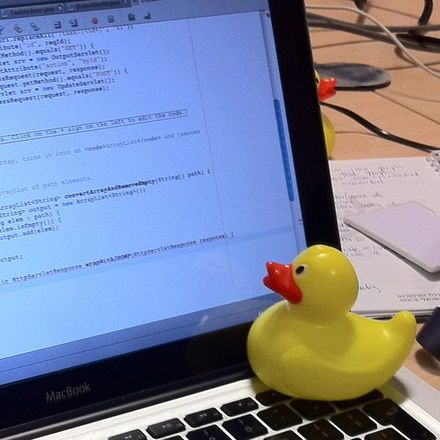

#👋 Olá, eu sou a Marianne! 
<p align="center">
  
</p>


🎓 Estudante de desenvolvimento web | 👩‍💻 Focada em me tornar desenvolvedora Front end  
📚 Atualmente aprendendo: HTML, CSS, Excel, Git e Github.
🚀 Em busca de oportunidades como estagiária na área de tecnologia  
💡 Apaixonada por resolver problemas e aprender coisas novas

## 🛠️ Tecnologias e Ferramentas

- 💻 Front-end: HTML5 | CSS3 (em aprendizado) 
- 🌐 Ferramentas: Git | GitHub | VS Code


## 📈 Objetivos

- Concluir minha formação como desenvolvedora full stack
- Criar projetos práticos para demonstrar minhas habilidades
- Conquistar meu primeiro estágio na área de desenvolvimento

## 📫 Contato

- Email: dmariannereis@gmail.com 
- LinkedIn: https://www.linkedin.com/in/marianne-reis-479a96345/

---

✨ Obrigada por visitar meu perfil!
```

---

 
<!---
Mariannereissss/Mariannereissss is a ✨ special ✨ repository because its `README.md` (this file) appears on your GitHub profile.
You can click the Preview link to take a look at your changes.
--->
